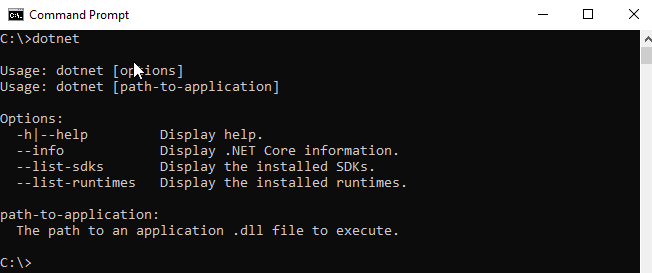
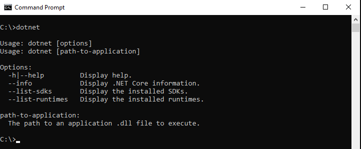
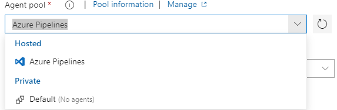
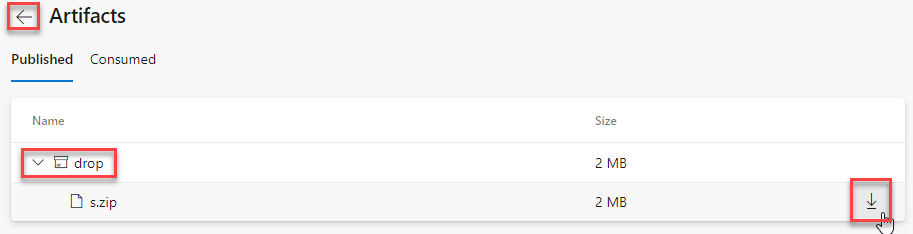
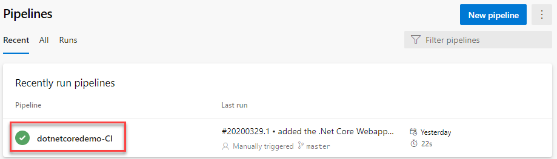
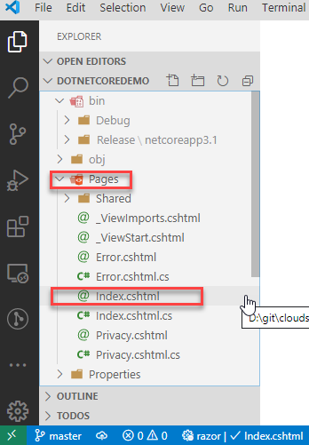
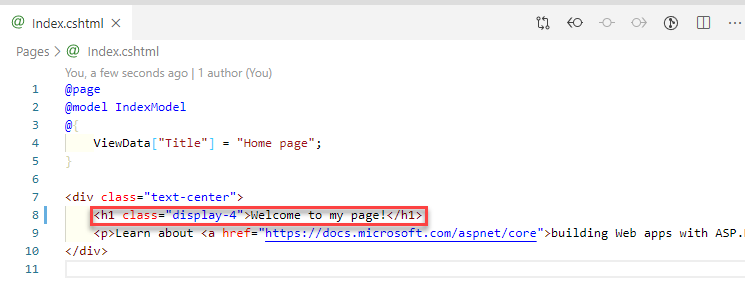

# Create an Azure Pipeline for a .NET Core Webapp and configure for Continuous Integration (CI)

The [State of DevOps 2019 ](https://services.google.com/fh/files/misc/state-of-devops-2019.pdf) documents two research models which are key in positively impacting Software Delivery performance. The performance research model:


includes Continuous integration as a construct in performance improvement.

In parts [one](https://cloudskills.io/blog/git-azure-devops) and [two](https://cloudskills.io/blog/git-azure-devops-2) of this guide, you have been working with editing the ```readme.md``` and pushing markdown changes to your Azure DevOps repo. To create a build pipeline in Azure DevOps you are going to need to work with some code.

In this part of the guide, you will install .Net Core and configure a .Net Core webapp project so that only the parts of the project that require to be under source control are stored in your Azure DevOps Repo. You will examine how the build process you use on your machine needs to be mirrored in an Azure DevOps Pipeline for a successful build. There is a key takeaway from this exercise, no matter the language used, the process to build locally needs to be mapped to the Azure Pipeline.

Once your build process has been mirrored you will automate the process which runs the build. These steps are the start of a journey towards Continuous integration.

## Prerequisites

Before working through this guide you will need the following:

* An [Azure Subscription](https://azure.microsoft.com/en-us/), you can create a free account.

* An [Azure DevOps Organisation](http://dev.azure.com/), the basic plan starts with the first five users for free.

* A local installation of [Visual Studio Code (VSCode)](https://code.visualstudio.com/download)

* A local installation of [Git](https://git-scm.com), following the [install guide](https://git-scm.com/book/en/v2/Getting-Started-Installing-Git) for your OS. If you are using Windows, ensure the box is checked to **Enable Git Credential Manager**.

    

    If you installed VSCode before Git, you will also be presented with this option:

    

    This allows you to launch VSCode as the default code editor or difference tool, straight from git on the command line.  Please leave as VSCode for this guide, you can reinstall later to pick a different IDE.

* An installation of [.NET Core](https://dotnet.microsoft.com/download), choose to Download .NET Core SDK for your OS and install. Once the installation is complete open a new command window and check .NET Core was installed properly by entering the command `dotnet`

    

    If you receive the output about from dotnet help, the installation was successful.  If you receive the following error:

    

    Make sure you open a new command window and try the command once more.

## Step 1 — Setup the ASP.NET Core Webapp project

As part of the pre-requisites, you installed .Net Core SDK ready to build a .Net Core project. To help understand how the Azure DevOps build pipeline is built, you'll look at some of the functionality of the .Net Core CLI. Once you've explored some of the key commands for the .Net Core CLI, you will create a new .Net Core Webapp project and configure the project for pushing to an Azure DevOps Repo.

.Net Core is cross-compatible across operating systems, this means you can run it on Windows, MacOS or Linux. When you installed .Net Core, the .Net Core CLI was automatically installed by the install process. This gives you access to the commands required to develop, build, run and publish .Net Core applications from the command line. You can fire up a command prompt, terminal on Linux or a Powershell/command terminal in Windows and use the same `dotnet` commands. The .Net Core CLI can also be called by graphical IDE's such as Visual Studio or Visual Studio Code, opening up access to the same commands from a user interface.

Open up your command line of choice and execute the command from the pre-requisites `dotnet`



Previously you used this command to check that the .Net Core SDK had installed correctly. The `dotnet` is the *driver* command, it will always be the first word when working with the .Net Core CLI on the command line. The driver command will either execute a command or run a .Net Core app. When executed on its own as shown above, the `dotnet` driver command gives instructions on how to get more help. Options can be added to the command, for example, the `dotnet` driver command can take `--version`:


Taking the option of `--help` from the driver command instructions listed above you can see the commands that can be executed with the dotnet driver. Enter `dotnet --help` into your command line to explore this further:


For a full list of commands and their usage visit the Microsoft Docs [dotnet command reference](https://docs.microsoft.com/en-us/dotnet/core/tools/dotnet).

Scanning up through the SDK commands you can see `new` is listed, with the description stating this is the command to create a new .Net project. Each of these commands can take the `--help` option to view help on their usage. Use `dotnet new --help` to view the help on the `new` command:


The output here is split into three sections. The screenshot above shows the first section. These are the options. You can filter the template names using `--list` or check for locally installed template updates with `--update-check`. The option `--language` allows you to pick between C#, F# or VB where the *template* supports it, with C# being the default. To examine what templates are available, here is the middle section of the help output, the list of available templates:


The command `dotnet new` uses the templates listed to create .Net Core projects based on the specified template. The template creates a project which will contain all of the files required to start building the application. Looking at the output above, the first column is the full template name, which gives the best description of what the template is for. The second column, Short Name, is the template name used when calling `dotnet new`.
For example, looking at the top line of the output, executing `dotnet new console`, will create a project containing all of the files required to start building a console application.
The third column displays whether F# and VB are available for the selected template. Taking the top line of the output once more `dotnet new console --language F#` will create a .Net Core project that can be used to build a console application in F#. For this guide you will be building a Web Application in Azure DevOps, therefore, `webapp` is the template name you will use when executing `dotnet new`.


The final section of the `dotnet new` output lists examples of how to use the command. Above are examples creating a model view controller app `mvc` and a [nuget](https://www.nuget.org/) config file `nugetconfig`. 

You are now ready to create the project for the webapp. Change directory on your command line to the dotnetcoredemo git repo you linked to an Azure DevOps Repo in [part one](https://cloudskills.io/blog/git-azure-devops) of this guide. If you have not followed part one, run through [Step 1 - Setup a Repo in Azure DevOps](https://cloudskills.io/blog/git-azure-devops) to create the required Azure DevOps Project and Repo. 
List the contents of the repo using `dir /a /b` on windows or `ls -al` on a Mac or Linux:


The local repository is pretty much empty, it has the readme you edited in the previous part of this guide and the .gitignore created by Azure DevOps. Create the .Net Core Webapp project files in this directory using `dotnet new webapp`


The `dotnet new webapp` command recreates the template structure in the directory it is run from, and then restores required packages to the template structure using `dotnet restore`. The project is now ready to use, you can explore the project in Visual Studio Code by executing `code .` from within the dotnetcoredemo folder:


In the explorer view of VS Code, you can see the outline of the template combined with the .gitignore and README.md from the local git repo. Looking to the top you'll see the obj folder is greyed out and the properties folder is a slightly darker colour of grey. This is due to the .gitignore you added in part one of the guide [Step 1 - Setup a Repo in Azure DevOps](https://cloudskills.io/blog/git-azure-devops). Open the .gitignore file in VS Code and scroll down to the Build Results section:


The folder obj has been flagged to be ignored, this is shown in the screenshot by being light grey. The obj folder and none of the files it contains will be pushed to the repo. If you scroll throughout the file, you'll see all the file types and folder names that should not have their files tracked in the git repository. Scroll to the .Net Core section, `**/Properties/launchSettings.json`. The instruction tells git to ignore launchSettings.json when it's found under the Properties folder, but not to ignore other files in that folder. The instruction not to include every file in the Properties folder is why this folder is a darker grey than obj.
The .gitignore keeps your repository lean, only code changes are tracked. This also stops binary objects such as compiled code packages, which git is not designed to version, from being stored in your repository.

If you did not add the .gitignore for Visual Studio previously, you can create this manually. Switch back to your command line and run `git status`:


This local repo has the .gitignore set for a .Net Core webapp so the Obj and Properties directories are not showing up in the changes above. Deleting the file and running `git status` once more:


The output from `git status` above in "Untracked files" is what you will see if your .gitignore was not added. On the command line create a new and empty .gitignore file using `nul > .gitignore` on windows or `touch .gitignore` on MacOs or Linux. Open the folder with `code .` and open the empty .gitignore file. Open a browser and navigate to [VisualStudio.gitignore](https://github.com/github/gitignore/blob/master/VisualStudio.gitignore)


The .gitignore for Visual Studio is displayed. This .gitignore file is from the collection of .gitignore templates held at [github](https://github.com/github/gitignore). Click Raw to open the raw content of the .gitignore file. Select all, copy and paste the content into the empty .gitignore file open in VS Code. Save the .gitignore file and return to the command line. Re-issue `git status`:


The status of the updated .gitignore file is listed along with the untracked files. Note here, if you hadn't set up your .gitignore previously, the .gitignore file will be listed under "Untracked files". Notice that the Properties folder is still present showing there is a slight difference between the .gitignore provided by Azure DevOps and the one from github. For this guide leave the settings as is, however, it highlights how a .gitignore file needs to be tailored for your use case.

You have created a .Net Core Webapp project from a template and set the local git repo to only push the changes that need to be tracked in version control. You are now ready to push your Webapp to the Azure DevOps repo. This process is identical to that performed when editing the README.md:


Your new webapp code has been pushed to your Azure DevOps Repo. Open the Repo in a browser to check the template code:


## Step 2 - Understanding the build and publish process

With your webapp code pushed up to the Azure Repo, you are now ready to create your build pipeline. The process of building the Webapp in Azure DevOps mirrors the process that you would type at the command line with `dotnet` or execute in an IDE such as Visual Studio. If you have not built an app in .Net Core before, you can walk through the steps below to explore the process before you switch to Azure DevOps.

Switch back to the command line and cd into the directory that your code resides in. The command to build an app in .Net Core is `dotnet build`:


Looking through the output above the first part of the build runs a restore (red box). The `dotnet build` command runs `dotnet restore` before the build process starts. The `dotnet restore` command reads the project file and restores package dependencies using NuGet. [Nuget](https://www.nuget.org/) is the *package manager* for .Net. A package manager gives developers the ability to consume packages created by Microsoft or other authors for use in their code. A developer can also create packages for their teams and others to consume from NuGet. This is a common design pattern, reusable code.

The project file name is listed next to the restore output dotnetcoredemo.csproj. Switch back to VS Code and open dotnetcoredemo.csproj.


This is a new empty project and you have not added any dependencies. If dependencies had been added to the project they would be listed where the empty space is marked on the screenshot above, which would look like this.


Looking back at VS Code, you can also see a bin directory has been created in your local repo. It is greyed out and marked to be ignored by the .gitignore. The bin directory is ignored as it contains binaries that should not be pushed to your repo. The bin directory was created by the second part of the `dotnet build` command. The output of this command was shown in the previous screenshot in the yellow box. [dotnet build](https://docs.microsoft.com/en-us/dotnet/core/tools/dotnet-build) takes the dependencies in the project file and builds the dependencies and the code into binaries. You can see the compiled code output as .dll files to the bin folder listed within the yellow box of the `dotnet build` output above.

If you look through the path to the .dll files displayed in the build portion of `dotnet build` it is `\bin\Debug\netcoreapp3.1\`, it contains the word Debug. When you build a .Net Core application it's default configuration is to create a debug build. For a production build and for this guide, you want to use a release configuration, to do this use the --configuration option `dotnet build --configuration Release`


Switching back to VS Code, you will now have Debug and Release builds in the bin directory:


If you open these folders you'll see the files that you need to run the application.  However, this is not the officially supported way to distribute the application. To prepare the application for deployment you need to run [dotnet publish](https://docs.microsoft.com/en-us/dotnet/core/tools/dotnet-publish) `dotnet publish --configuration Release` where the configuration option is the type of build you want to publish:


The publish directory now contains all the files required to deploy your application.

If you step back through the processes above you will see there are three steps:

1. `dotnet restore` - restore dependencies and code
2. `dotnet build`   - build your code
3. `dotnet publish` - publish for deployment

If you recall the very start of this step of the guide, you need to mirror the process from the command line to Azure DevOps. Therefore, the three steps above are those required to build and publish your webapp in Azure DevOps. Switch to Azure DevOps so you can explore this process.

## Step 3 - Create a build pipeline

Switching back to Azure DevOps you should still be in the Azure Repo for the dotnetcoredemo project. Choose Pipelines in the left-hand menu and then Pipelines once more:


An Azure *Pipeline* is used to automate building a project.  You can build your code, test your code, analyze the quality of your code and feedback the results all within one pipeline. Thus providing some of the fast feedback loops that are a corner-stone of DevOps.

To start creating a Pipeline, click Create Pipeline:


You now have the choice to start creating a Pipeline in YAML, by selecting where your code is stored. Building a pipeline in YAML is best practice when using Azure DevOps. It allows you to version control your pipeline in the same code repository as your code. However, when you start to configure Pipelines, it is best to use the UI. This allows you to explore the basics of a pipeline by adding items to the pipeline manually. For manual work with the pipeline, you will need to use the classic editor. Click on the classic editor:


The classic editor starts with the choice of where to select your repository from. The repository selector defaults to Azure DevOps, with the current project and Azure Repo loaded if you have one. You can also select which branch of your Azure Repo to build from. Your Git workflow set up in part 2 of this guide expects builds to be from the master branch. The settings should be all defaulted in for you, so click continue:


The classic editor is pre-loaded with templates to carry out different types of build. You are building a .Net Core Webapp, so scroll down through the templates and click on ASP.NET Core and then click Apply:


The template for a .Net Core pipeline is loaded. Looking at the *tasks* that have been created for you, you'll see they almost mirror the steps we looked at for publishing a .Net Core application locally. A [task](https://docs.microsoft.com/en-us/azure/devops/pipelines/process/tasks?view=azure-devops&tabs=yaml) in Azure DevOps are steps required to automate a process, in this case, a build, within a pipeline.


There is an extra task - Test, this will run tests as defined in your code repository. Testing code using unit tests at the build stage is another essential part of DevOps. However, for this guide there are no test tasks defined in your repository, therefore we can delete this task. Click on Test, then in the top right click Remove:


The test task is removed and the pipeline now mirrors the steps for publishing a .Net Core application you explored in Step 2 of this part of the guide. Click on Pipeline at the top:


These are the settings for the pipeline.  You can configure the following for this configuration:

* Name - you can alter the pipeline name to fit the pipeline you are creating. Change this to dotnetcore-CI.

* *Agent Pool* - an [agent](https://docs.microsoft.com/en-us/azure/devops/pipelines/agents/agents?view=azure-devops&tabs=browser) is a Virtual Machine which has software already installed ready to run the tasks in your pipeline. An Agent Pool is a group of agents of identical specification and configuration. An agent pool can be utilized across one or more projects in an Azure DevOps Organisation. Agent pools are hosted by Microsoft or Self Hosted (Private). The default is a Microsoft hosted pool named Azure Pipelines, this is what you will use for the build in this guide. You can see it is Microsoft hosted by selecting the dropdown:

    

* *Agent Specification* - you chose the default of a Microsoft hosted agent pool, which enables the agent specification drop-down. The agent specification dropdown gives you the option of selecting a specific operating system to suit the requirement of your build. Each [specification](https://docs.microsoft.com/en-us/azure/devops/pipelines/agents/hosted?view=azure-devops#use-a-microsoft-hosted-agent) can have slightly different software pre-installed to run the build tasks. You can choose from MacOs, Windows, Linux, select the dropdown to explore the options. .Net Core is cross-platform and can be built on Linux so leave the specification as ubuntu-16.04:

    

The pipeline settings are correctly configured, now click on Agent Job 1. A *job* is a series of tasks that are run sequentially. A [job](https://docs.microsoft.com/en-us/azure/devops/pipelines/process/phases?view=azure-devops&tabs=classic) runs on an Agent. In this guide we are creating a build, so edit the name of the job to Build. Leave the rest of the job configuration at the defaults. Click on Restore:


In the right-hand pane is the heading .Net Core, with an information icon next to it. Click the information icon:


Here you see the information about the task. This is the .Net Core CLI task, it has the same functionality as running `dotnet` on your local command line. It is the dotnet driver. Exploring the options for this task:

* *Task version* - each task is versioned to stop issues with backwards compatibility when new functionality is released for a task. Leave this as 2.*.

* Display name - this is the name shown in the job on the left-hand side of the pane, leave as Restore.

* *Command* - this is the command sent to the dotnet driver, in this case it is restore. If you click the dropdown for the command you can see the same commands you viewed when running `dotnet --help` on the command line:
    
    

    Choosing Restore gives the same functionality as running `dotnet restore`. Leave this as restore. 

* Path to project(s) - if you recall from Step 2 of this guide, `dotnet restore` restores the dependencies from the .csproj file. This path defines where to find the .csproj file within the project.

The defaults are all acceptable here, click Build:


The first four configuration options shown are identical to that of the Restore task above. However, the command is using `build`. If you recall the build section of Step 2 of this part of the guide, you have the option to build a Debug or Release optimised build. To do this you use the `--configuration` parameter. You can see this at the bottom of the screen-shot above defined as the Argument `--configuration $(BuildConfiguration)`. Items defined with $() are *Variables*. Variables can be created at the Pipeline level and used throughout the Pipeline. To see this click on Variables towards the top left of the two panes:


The BuildConfiguration variable has been set up by the .Net Core template to Release. This pipeline will build a release optimised application. Click on Tasks and click on Publish:


Once again the first four configuration options have the same function, with this task using the `publish` command. This task is set up to publish the .Net Core web project and zip up the output. If you look at the Arguments for the `publish` command, there is a new argument, `--output`. This is instructing the publish to place the items being published into a specific directory. The directory `--output $(build.artifactstagingdirectory)` looks like a pipeline variable. However, it is a [predefined variable](https://docs.microsoft.com/en-us/azure/devops/pipelines/build/variables?view=azure-devops&tabs=classic#build-variables), this has been automatically set by Azure DevOps. This defines a path on the agent where the published output will be copied to.

The defaults here are as required, click Publish Artifact:


At the point `dotnet publish` finishes on the Agent, the application is still on the agent and needs to be copied out and made available for use. At the top left of the right-hand side pane, click the information icon next to Publish build artifacts.


The [publish build artifacts](https://docs.microsoft.com/en-us/azure/devops/pipelines/tasks/utility/publish-build-artifacts?view=azure-devops) task enables you to copy your published build out to Azure DevOps or a file share. The item published at the end of the build is known as an *artifact*, it is a collection of source code and dependencies that make up a deployable component of an application. In the case of this guide, there is only one component so the artifact is the application.

Looking through the task options, Task version and Display name have the same purpose as previously described tasks.

* *Path to publish* - this is the path on the agent to get the artifact from. You can see the template has been set up to use the same variable `$(build.artifactstagingdirectory)` that was used for the `dotnet publish` task. This ensures that the output from the `dotnet publish` task is published as the artifact.

* *Artifact name* - the name of the artifact you wish to create.

* *Artifact publish location* - choose between publishing the artifact within Azure DevOps for other pipelines to use or on a file share:

    

You can leave all of these at the default options. Your pipeline is now ready to run!


## Step 4 - Manually running a pipeline

You have set up the job and it's tasks for your pipeline, but so far it has not been saved. Click Save and queue at the top of the classic pipeline editor page. Now click Save and queue in the drop down, this saves the pipeline and queues it to run:


This brings up the Run pipeline page, which enables you to manually run your pipeline. 


The Save comment is optional, however, you can add a meaningful comment to your run. The rest of the options are taken from the pipeline setup.  You will notice that the top three drop-down boxes are taken from the Pipeline settings you explored near the top of this step in the guide. Click Save and Run to run your pipeline:


The run page loads and the job is queued. The pipeline is now trying to get a build agent from the hosted pool, this is why it is queued. Once the build agent is assigned the Job starts to run:


Until it is either listed as a Successful or Failed build:


At any point you can click on the name of the job to look at the status of each task in the build.  Click on the job name to explore the output that is displayed by the running tasks:


The top of the list of tasks is the job summary, here you can see the pipeline settings, how long the job ran, and that an artifact was produced. The artifact message is a link, click on it to view the artifact that was published:



You can expand the drop folder and see the zip file that was published. If you hover the mouse to the right of either the zip file or drop folder you can download the output. Download and open the zip file, it has the same structure as your /Release/Publish folder had in Step 2 of this part of the guide:


The build status had already marked the build as successful, however, you have just checked this by looking at the published artifact. Now you can explore some of the output from the steps in the build. This process can also be used to debug the build in the case of failure. If any of the steps had failed, the status circle to the left of the task name would have contained a red cross. Click the back arrow at the top left by Artifacts, scroll down and click the job name and then click "Checkout dot...":


The first task the agent must perform is to fetch the repo and checkout the master branch. You didn't have to perform this task locally as you already had your code in your local repo. The commands in blue in the output windows are the `git` commands being issued. The build agent is performing the same sequence of commands to fetch the code and check it out, they just look slightly different:

* `git init "home/vsts/work/...` - the path to initialise the git repo in is being passed to init, rather than calling init from inside the folder.

* `git remote add origin` - this is identical to the command you would call on your local command line.

* `git -c http.extraheader="AUTHORIZATION: bearer ***" fetch --force --tags ..... origin` - this is a git fetch. `-c http.extraheader="AUTHORIZATION: bearer ***"` is overriding part of the git config with a bearer token to add into the header. The stars show the bearer token has been hidden as it is a secret. This token gives the agent access to the Repo, the agent does not have to login. The fetch is fetching the origin remote, you can see `origin` at the end of the command.

* `git checkout --progress --force adfd5b...2825d` - this is a git checkout, it is switching to the SHA checksum of the last commit to master when the build job started:

    
    You can verify the SHA is correct by switching to the commit history in the Azure Repo. The initial 8 characters of the SHA checksum are displayed, however, if you hover to the right of history line, you can copy the SHA checksum from the "More" menu to see it is identical. Note, you must compare the ones in your repo/checkout output, as they will be different from the ones shown here.

    The command `git checkout origin master` will switch to master as it looks when the git checkout command is run. If there was a time delay in acquiring a build agent, it is possible further pushes to master have happened in that time. This is why the SHA checksum is used, it guarantees that the code being built is how it looked when the pipeline run started.

Now click on the Build task:


You can see the `dotnet build` command in blue, it is being passed the full paths to the .csproj file, along with some options for logging. It is, however, performing an identical process to that carried out locally on your machine. You can verify this by comparing the `dotnet build` output from your command line, to that displayed in the task output. You should see the only difference is the output paths.

Click on the other steps to familiarise yourself with how task output looks between different types of tasks.

You've now finished exploring a manual run of an Azure Pipeline. However, you do not want to be triggering a build manually after every pull request! Automating the builds will add further value, this is part of the process for Continuous Integration.

## Step 5 - Configuring for Continuous Integration (CI)

[Continuous integration (CI)](https://docs.microsoft.com/en-us/azure/devops/learn/what-is-continuous-integration) is the process of automatically building and testing code when it is committed to version control. This can be on every push, or a pull request completion. The process can also be automated for changes from one or more branches.

Azure DevOps supports CI through *triggers* on the pipeline. A trigger can be:

* CI trigger - builds are triggered on every push to a branch or branches.

* PR trigger - builds are triggered on a push to a  pull request on specified branches.

* Scheduled trigger - builds are scheduled for specific times of the day/week. This can be useful for a testing team new to DevOps who would like to start with a nightly build.

* Pipeline trigger - this is for large products with dependant components. If a change is detected in a dependant component, the trigger will fire off a new build.

To set this up in Azure DevOps, you will need to edit your pipeline. Enter the Pipelines menu:



Click your pipeline name:


Here you can view the runs for your pipelines. Click Edit in the top right:


You are taken back into the pipeline classic editor you worked with to set up the pipeline. Towards the top, click the triggers tab:


Here are the options as discussed in the CI introduction above.  It is not possible to use Build completion, also known as a Pipeline trigger, as there is only one pipeline in this project.

You are setting up a Continuous Integration trigger for this pipeline. To do this, click the project name under Continuous Integration and tick Enable continuous integration:


There are some options you can set on continuous integration:

* Batch changes while a build is in progress - if you work on a large team where there are frequent pushes and/or PR completion pushes, you may end up queuing multiple builds while a build is still in progress. This checkbox will stop each of these pushes being queued as a separate pipeline run. It will queue one run of all the changes once the current build is complete.

* Branch filters - include or exclude branches for the trigger.

* Path filters - this is often used to exclude changes from a build, for example, "always trigger on master except for when there are changes to the reports folder". In which case you would exclude the path to the reports folder in the Path filter and include master in the Branch filter.

For this guide, we are going to trigger on every push to master, so accept the defaults by clicking Save & Queue and Save:


You can optionally add a comment for your pipeline change, then click save:


This saves the changes to your pipeline but does not manually kick off a build. To trigger this you will need to push a change to your Azure Repo.

Switch back to VS Code, you are going to make a small change to the index page of the webapp to trigger the build. Open Pages/index.cshtml:



Edit the header line to something appropriate:



Save the index.cshtml page and switch to your command line to push the change to your repo:


Quickly switch back to Azure DevOps, and click on Pipelines:


The pipeline has been queued. Click on the pipeline name to view the pipeline runs:


Your first run states it was Manually triggered, the latest run says it was triggered by an individual CI. Your push to master has triggered the build.

Congratulations, you have automated your build process!

---

## Conclusion

In this article, you have explored how the .Net Core CLI works. You used the CLI commands to create a .Net Core Webapp project which you pushed to an Azure DevOps Repo. You examined the .gitignore file and how it is important to keep your code repository lean and to not check in binaries to your repo.

You configured an Azure DevOps build pipeline, mirroring the build process from your local machine into the pipeline. You manually triggered your pipeline and watched the steps execute to view where you would debug the process if there was an error. Once the build was successful, you verified the published output by downloading the artifact and checking the contents of the compressed file.

Finally, you automated the process by enabling a Continuous Integration trigger on the master branch of your Azure DevOps Repo. You tested the automation by pushing a change to master and verified that the build was triggered by the push.

If you recall the definition of [Continuous integration (CI)](https://docs.microsoft.com/en-us/azure/devops/learn/what-is-continuous-integration): "It is the process of automatically building and testing code when it is committed to version control." If you also look back to the beginning of this part of the guide, Automated testing is displayed as a driver to the Continuous integration construct. To add further value to your newly automated build process, you must be automatically testing every build. The next part of this guide will add a test and a test task to your pipeline.