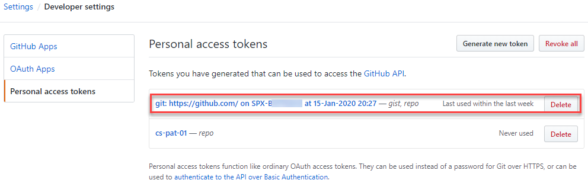

# Getting started with Git and Azure DevOps

According to the [State of DevOps 2019](https://services.google.com/fh/files/misc/state-of-devops-2019.pdf), best practice use of version control is one of the foundations for improving Software Delivery and Operational (SDO) Performance. In this first part of a three part guide, you'll be working with Git and Azure DevOps to setup a repository which you'll use for source control. Source control, also known as version control, has many benefits, each of these benefits come together to create a feedback loop to a team working on the code under version control. These benefits include:

* Collaboration - teams can work concurrently, even on the same sections of code, which are merged together.
* Workflows - teams check the quality of each others code, ensuring compliance with coding standards.
* Versioning - source code can be tagged so that released versions of code can be referred back to. 
* History - a full history of the code repository is maintained and linked to a users credentials. If changes are well commented, this can assist in issue resolution.
* Automation - actions within a version control system, such as checking in a code change, can be set to trigger other operations, such as compilation and testing.

Once you've worked your way through part one of this guide you'll be able to work with Git, a distributed version control system. You'll setup a code repository as part of a project in Azure DevOps, and a single repository in GitHub, enabling you to work with remote version control in the cloud. You'll be able to initialise both repositories, create copies of them locally and make changes to the files within those repositories locally. Once your changes are complete you'll be able to push those changes back to the Azure DevOps or GitHub repository, using the processes that will enable you to collaborate with a team.

## Prerequisites

Before working through this guide you will need the following:

* An [Azure Subscription](https://azure.microsoft.com/en-us/), you can create a free account.

* An [Azure DevOps Organisation](http://dev.azure.com/), the basic plan starts with the first five users for free.

* A [GitHub](https://github.com/) account, sign up to the free plan, this gives you unlimited repositories.

* A local installation of [Visual Studio Code (VSCode)](https://code.visualstudio.com/download)

* A local installation of [Git](https://git-scm.com), following the [install guide](https://git-scm.com/book/en/v2/Getting-Started-Installing-Git) for your OS. If you are using Windows, ensure the box is checked to **Enable Git Credential Manager**.

    

    If you installed VSCode before Git, you will also be presented with this option:

    

    This allows you to launch VSCode as the default code editor or difference tool, straight from git on the command line.  Please leave as VSCode for this guide, you can reinstall later to pick a different IDE.

## Step 1 — Setup a Repo in Azure DevOps

In this step you will setup a project within Azure DevOps. An Azure DevOps project can be either public or private, where private projects require a user to be invited before the project can be viewed, cloned or contributed to.

A repository is a place to store version controlled code, enabling one or more developers to collaborate on the code, keeping a history of all changes.  This is known as source control. You'll be adding a project which will automatically create a repository, this will enable you to add code and make changes to that code in further steps, simulating how an individual or team works with source control.

First, you need to setup a project, open a browser and navigate to [Azure DevOps](http://dev.azure.com/) and login the credentials which you used to create the Azure DevOps organisation in the prerequisites.

The option, Choose Start free with GitHub, is for teams already using source control in GitHub. In this guide you have no version controlled code and want the repositories to sit within Azure DevOps, so choose **Start free**.

Next enter a **Project name**, the main steps in this guide use dotnetcoredemo. For **Project visibility**  choose to use a private project, this gives you control over who has access to your project.  If you were running an open source project, this would be public. Last pick an appropriate **Country/region** for your locality.

The project is created and the project page for dotnetcoredemo is opened:

This is an empty project, the menu on the left shows the services, Boards, Repos, Pipelines and Test Plans. For this step you want to be working with a repository so choose **Repos**.

This is a view of an empty repository, to work with this repository locally, either from the command line or from a client, you will need to generate credentials. On this page you can see a button marked **Generate Git Credentials**, this will allow you to set a username and simple password to work with the repository.  However, it is not recommended, as these credentials have full access to the repository, along with other services and do not expire. The Microsoft Docs article [Authentication overview](https://docs.microsoft.com/en-gb/azure/devops/repos/Git/auth-overview?view=azure-devops) for Azure DevOps recommends to use a Personal Access token, where scope of access and an expiration date can be set.

To create a Personal Access Token, click to open the account settings menu which is top right, then choose **Personal access tokens**.

You can now see a list of all of your personal access tokens, as this was an empty organisation you will only see the default token created when the organisation was created.  Click on **New Token**:

The form to create the Personal access token is displayed:

Working through the options, **Name** is the name of your Personal access token, it needs to be unique for your tokens. **Organization** is your Azure DevOps organisation, at the moment you have one. However, if the logged in user has been granted access to multiple organisations, you can choose "All accessible organizations" from this dropdown. **Scopes**, here you choose which services this Personal access token can work with. Select **Custom defined**, as you will want to be using the principal of least-privilege.  Each [scope](https://docs.microsoft.com/en-us/azure/devops/integrate/get-started/authentication/oauth?view=azure-devops#scopes) maps to a set of permissions for one of the services you saw on the left when you entered Azure Devops for the first time.  For this guide you want to work with code, to read and write from the repository, so choose **Read, write, & manage** and status from the **Code** section. Scroll up and down through the Scopes to get an idea of how a Personal access token can be tailored, leave all other scopes unchecked. Click **Create**.

Your Personal access token has been created and can be copied from the successful creation page. Note here the warning from Microsoft, once a Personal access token has been generated and this page closed, it cannot be recovered.  Therefore, you must store this securely.  If the token contents are lost, it can be regenerated. To regenerate a token, select the token in your Personal access token list and click regenerate:

The success screen is displayed once more and the regenerated token can be copied.

If the token is compromised, it can be revoked, which removes the token from the PAT list.

You now have a Personal access token to access your Repo, so the next step is to start working with the Repo locally. Click **Azure DevOps** in the top left of the page to take you to your Azure DevOps Organisation home, choose the project that you created earlier, **dotnetcoredemo** and you are returned to the project page with the resources for the project listed in the menu on the left. Click **Repos** on this menu to enter the empty repository page. The repository is currently empty, you can choose to initialise it with some common repository files. 

Scroll down to the bottom of the Repo page to the **Initialize with a README or gitignore** section. Ensure **Add a README** is checked, this will create a readme file at the root of the repository. Typically, a readme gives instructions on how to use the repository, a readme file is a [markdown](https://daringfireball.net/projects/markdown/) file. You will also want to add a .gitignore file, this file instructs git to ignore directories and file types that are required for your project, but should not be stored under source control in your repository. In this part of the guide we are going to use simple text files, but for an example of a working .gitignore, we will setup the project for .NET, so use the dropdown to select **VisualStudio**.  Click **Initialize**.

Your Repo is no longer empty, you can see the file list which now contains the readme and .gitignore. The readme is stored at the root of the Repo and is automatically displayed on the page as it is expected to contain instructions on how to use the Repo. Click on the .gitignore file to view an example of a setup for a software development project.

## Step 2 - Cloning the Azure Repo

In this step you'll look at *cloning* a repository to create a local copy on your file system, enabling you 

When working on code stored in a distributed system such as Git, which is the backend for an Azure DevOps Repo, you take a full copy of a repository by cloning the repository. This recreates the entire history of the repository locally on the users machine. Click **Clone** in the top right:

In the **IDE** section there is the option to **Clone in VS Code**, this will launch VSCode, prompt where to save the repository locally, and open VSCode session with the newly downloaded repository open as a folder in VSCode.  Looking at the screen shot below, you can also see the same feature is available with other IDE's:

For this guide you are going to use Git on the command line, this will allow you to understand the mechanics of what each command is doing as it will not be hidden by an IDE.  To do this click the copy button (shown in red above).

Open a command prompt locally, and `cd` to the directory you would like to clone the repository into. Type `git clone` at the prompt, this is the git command for cloning, and then paste in the URL copied from Clone Repository above, this instructs Git where to Clone the repository from:
Hit return, and you will be prompted to enter a password. At the password prompt, paste in the Personal access token you saved earlier and hit return once more.  If the credentials are correct, the Repo is cloned:

The highlighted section in white shows the password being accepted for the Repo and the four objects being cloned to the machine locally. You only created two files, a readme and .gitignore, why are there four objects:

If you list the contents of the directory structure using `dir /b` (`ls` on Mac), you can see the first object, the folder that contains the repository. `cd` into the repository folder and list the contents once more, the items listed are the second and third objects, the two files you created in the Azure DevOps portal. Altering the list command slightly to output all files and folders using `dir /a /b` (`ls -al` on Mac), the hidden .git directory is displayed.  This is the forth object and is where Git tracks the local changes.  Note on a Mac the .gitignore will not be displayed on listing the folder contents without `ls -al`, it is treated as a hidden file.

Note - the first time you connect to your repository on a windows OS you will be prompted to enter the credentials you sign into Azure DevOps with:

Once successfully entered, the Git credential manager creates a Personal access token for you and caches it locally. You can view this by going back to the list of Personal access tokens in Azure DevOps:

You will see a third Personal access token, the name of which has been auto-generated based on the machine name Git generated it from.  You also have default Scope, which may need to be edited.

You now have a locally cloned repository which has no changes from that on the server.  You can check this using the `git status` command:

The highlighted section shows that there are no changes.  Next you'll look at adding changes back to the locally cloned repository and then into the Azure Repo.

## Step 3 - Saving changes with commit and push

When you work with code within a repository, the repository needs to be instructed that you want changes you have made to the code within it to be *committed* to the repository. The process of committing saves your changes to the repository, tracking the changes and linking them to your credentials. It is best practice to group your commits into work items, such as a defect fix from issue tracking software, or a completed task from a sprint. This will keep the changes small, updating often, this will avoid conflicts when merging back with other changes. Until the point of commit, changes are not tracked in the repository, only on the local file system.

To see this in action you need to edit your local repository files, to do this you can launch VSCode from within the repository folder on the command line using the `code .` command:

VSCode opens with the dotnetcoredemo repository opened in the explorer view on the left hand side. Clicking on the readme.md opens the file in the editor:

Edit the header change the text to `# Introduction to Azure Repos` and save your changes. Switch back to the command prompt and run `git status` once more from within the dotnetcoredemo directory:

Git status has picked up that there is a modification to a tracked file on the file system and has displayed this, if there was more than one change, all changes would be listed here. At this point the repository is not tracking the listed changes, the notice that **Changes are not staged for commit**, indicates this is the case.  To track the changes you first need to *stage* the changes. For this you need to issue the `git add` command. You can stage a single file using it's filename with the `git add filename` command or if you have more than one change to stage, you can use a full stop `git add .`, to add all changes. If you now re-run `git status` :

The filename is now shown in green, it has been staged and is ready to be committed to the repository to be tracked locally. Issue the commit command `git commit -m "commit message"`, where the commit message describes the change, or details a work item such as a defect number:

The unique identifier for the commit is displayed first, along with a summary of what has changed.  If you now issue a `git status` as shown above, you can see that your local repository is described as 1 commit ahead of the Repo is was cloned from, this is because you have committed one change since you checked out from the Azure DevOps Repo.

Your change has now been tracked locally, but you haven't updated the Repo to store the changes in Azure. To do this you need to use the `git push` command to push the committed changes from your local repository in to the Azure Repo:

You can see the git push command compressing the committed changes and pushing them to the Azure DevOps Repo. Once this process is complete, if you re-issue `git status`, the message **Your branch is up to date with 'origin/master'** indicates that the local and Azure DevOps Repo are back in synch.

Switch back to the Azure DevOps portal, this time click on **Commits** under the **Repos** menu item on the left hand side:

The Commits page shows the list of commits against this Repo, if you now click on the **Commit** text of the Updated the readme commit you can inspect the differences in the files between the two commits:

This view shows the original line 1, it is in red with the minus sign in front of it, and it's new text in green with the plus sign at the beginning.  When there are multiple changes within a file, this view can be difficult to review, you can change this by clicking **Inline diff** to switch to the side by side view:

Next you will look at how to bring in committed changes from other users.

## Step 4 - Updating Code with fetch and pull

Distributed version control systems such as Azure Repos enable teams of developers to work on code and commit changes at the same time. Therefore, there are times when you cannot be sure you have the latest version of the code. When this is the case, you will need to execute some Git commands to ensure you have the latest version in your local repository:

* `fetch` - downloads the changes from your remote repo, but does not apply them to your code. This allows you to take a look at the changes before applying them.

* `merge` - applies the changes taken from a fetch to a branch on your local repository. Once you have looked at the fetched changes and decided they are suitable to add to your code, you choose to `merge`.

* `pull` - combines the above, does a `fetch` and then a `merge`.

To simulate another developer making a change and pushing it to the Azure Repo, switch back to the Azure DevOps portal, click **Files** under the **Repos** menu item on the left hand side, and click on the README.md filename to open the file in **Preview**:

If Azure DevOps knows how to display a filetype, such as Markdown, it will open in file preview, formatting the file appropriately. To edit the file click **Edit** top right:

Edit the file and change the heading **Getting Started**, click **Commit** in the top right, you will now be prompted to enter a commit message:

Enter your commit message and click **Commit** at the bottom, in the background Azure DevOps is executing the same `git commit -m` command you used in an earlier step. The difference being that Azure DevOps is committing the change to the Azure Repo and not locally. So if you switch back to VSCode and edit the README.md file, you will see that the heading still says Getting Started.

The local repository and the Azure Repo are now out of synch, to have the change reflected in the local repository you *pull* the changes to your local repository.  This will execute a `git fetch` and a `git merge`:

The change made in Azure DevOps has now been pulled down to the local repository, if you switch back to VSCode, the change to the header line is now visible.

## Step 5 - Pushing an existing repository from the command line

You've explored working with a repository created with Azure DevOps, by cloning that repository locally, pushing to, and pulling changes from the Azure Repo. What happens if you have already got a local repository and need to push that repository to a new Azure DevOps project? To simulate this you need to *intialise* a new git repository locally, you will then add a README to this repository and push it to a new Azure DevOps project.

Initialising a repository creates an empty repository using the same method utilised by Azure DevOps in Step 1.  Both of these processes both use the `git init` command.  When executing the command locally, it must be executed within folder that does not already contain a git repository, however, the folder does not have to be empty:

The process here is to make a new empty folder using `mkdir` on the command line, `cd` into that folder and then execute `git init`. The section highlighted above shows the Git repository being initialised and then `dir /a /b` (`ls -al` on a Mac) to display that the repository is empty, apart from the newly created .git folder.

Next, you need to add a file to simulate code being present in the local repository.  Execute `code .` on the command line to launch VSCode within the repository and then create a README.md file for the repository:

Enter some text within the file and save. Switch back to the command line and execute `git status` to verify that Git has picked up the change on the file system.  Now execute `git add .` to stage all changes ready for commit, then commit the change using `git commit -m` and add an appropriate message:

You now need to create a new project within Azure DevOps, so switch to the Azure DevOps portal and click **Azure DevOps** top right to return to your Azure DevOps organisation, click **New project** in the top right hand corner, this opens the add project page:

The create project page displayed is slightly different than the one displayed for a new Azure DevOps organisation.  You will need to enter the **Project name**, making it the same as the folder name of your local repository. If you scroll to the bottom of the page, you can also select **Version control** which always defaults to Git, but can be changed to Team Foundation Server.  Click **Create** to create the new project.  When the new project is created, click on **Repos** in the services menu on the left, you will see the same empty repo page as viewed in step 1. Scroll down to **Push an existing repository from command line**:

Here you can see the URL for the *remote* called origin. A remote repository in Git is a version of the project hosted either on the internet or on a local network, in the case of this guide, within Azure DevOps. Origin is just the default name for the URL, it's shorthand name.  If you execute `git remote` from inside a repository, all remotes for the repository are listed:

You have a new locally intialised repository with no remotes, so none are listed at this stage. Switch back to Azure DevOps and copy the first part of the command for pushing an existing repository:

The remote has been added and re-issuing `git remote` lists origin as a remote. You now need to push your changes up to the origin, to do this execute `git push origin master`, this pushes all changes from the local master branch to the origin:

Switch back to Azure DevOps portal, click **Repos** and then **Files** on the services menu for the localgitinitdemo project, the Repo now reflects the repository pushed up from local:

## Step 6 - Working with GitHub

Azure DevOps Repos is just one of the Git backed source control systems where repositories can be stored remotely. GitHub is also a Git backed system, it was a forerunner to Azure DevOps Repos. GitHub is the industry standard collaboration platform for open source software projects, enabling developers to contribute to code repositories all over the world. In this Step you will look at working with GitHub repositories using Git.

Sign into GitHub with the credentials used to create the GitHub login in the prerequisites step:

This is an empty project, there are no repositories in it yet. Click **New** top right to add a new repository:

The content this page requires is the same as that of an Azure Repo.  Enter a **Repository name**, leave the repository at it's default of **Public**, you can also initialise a README.md and a .gitignore. The extra dropdown allows you to choose an open source license for this repository, which is very common on GitHub.  Click **Create repository**, the repository is created and the repository page is automatically loaded:

Scrolling down through the repository page, you can see git commands for creating a new repository or pushing a new repository from the command line.  These commands are exactly the same as those for Azure DevOps, the difference is the address of the remote, which is pointing at your GitHub repo.  To explore this start by initialising a local repository:

The commands used here are identical to that of Azure DevOps, first create an empty folder with `mkdir githubdemo` using the same name as the repo you created in GitHub. Next `cd` into the folder and initialise with `git init`. Use the `echo` command to quickly create a README with a single header `echo # Welcome to GitHub >> README.md` (`echo "# Welcome to GitHub" >> README.md` on a Mac).  Execute `git add .` and `git commit -m "message"` to stage and commit your changes locally. You are now ready to push changes to the GitHub repository, however, even though it is a public repository, you still need permissions to access the repository. Switch back to the GitHUb repository in your browser, click on the profile icon in the top right, and click **Settings**:

Scroll down to the bottom of the Settings menu and click **Developer settings**. In the left hand menu of the Developer settings page is **Personal access tokens**.  GitHub uses a similar mechanism to grant access to it's repositories as Azure DevOps. Click **Generate new token**:

Once again you can see the similarity with Azure DevOps Repos. You need to enter a **Note** to say who the token is for and grant the **Scope**, in this case ticking **repo** to grant access to public and private repositories with this token.

  

Scroll to the bottom of the page and click **Generate token**, to generate the token:

  

The generated token page warns you that you must make a copy, as the token cannot be recovered. Once you have taken a copy of the token, navigate back to the repo page and take a copy of the first command for **…or push an existing repository from the command line***. Switch back to your terminal window and execute this command inside the folder where the `git init` was run and README.md file created.  This creates a remote called origin which points at your GitHub remote. Now you can execute a `git push origin master` to push the local master branch to your remote:  

Note - on a Windows OS you will be prompted for your github credentials, when the page is displayed enter your username and password as if you were logging into GitHub on your browser:

Once you've entered the credentials, if you switch back to GitHub in your browser and navigate back to the Personal access token page, you'll see that entering the credentials has created it's own Personal access token, setting a scope of Repo and Gist:

This will only happen on Windows. On a Mac you will be prompted for your username, and then a password. At the password prompt you must enter the Person Access token that you generated.

Once you have your changes pushed up, switch to the repository view in GitHub in your browser to check the changes have pushed successfully:

The commit message entered is displayed against the commit, and the test added to the markdown can be seen within the README.md

## Conclusion

In this article, you've explored how to work with Git and Azure DevOps / GitHubs respositories. How to setup an empty repository, then push a current code line to it, or create from scratch within the portal or on the command line.  You've simulated updating your code following a change from a team member, and how to use access tokens to push code from a command line or IDE.

The next part of this three part series will take you through setting up a workflow which enables the same code lines to be worked on by a team, merging changes, whilst keeping code quality and standard compliance in check.