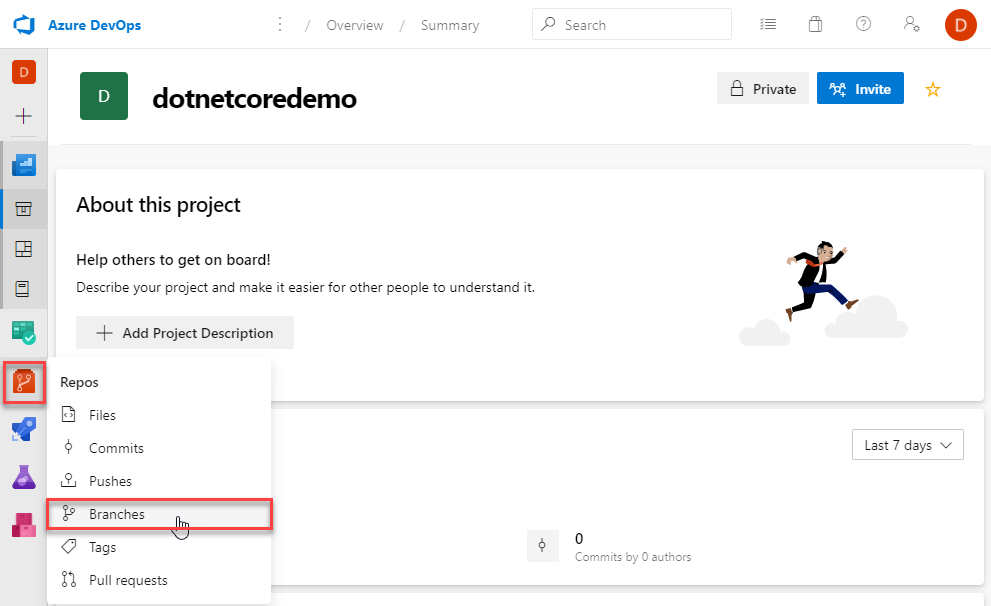
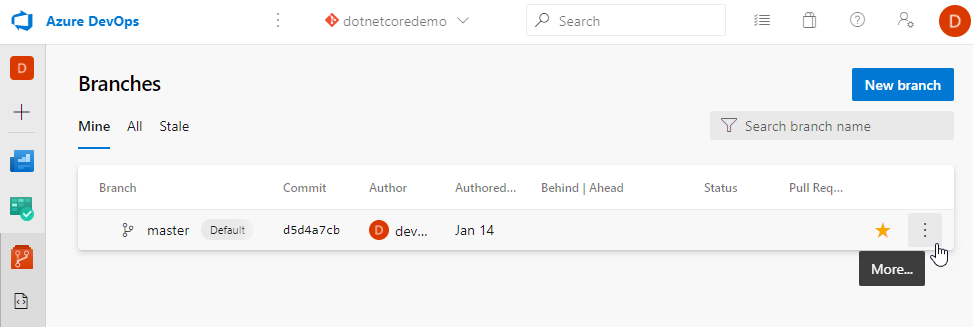
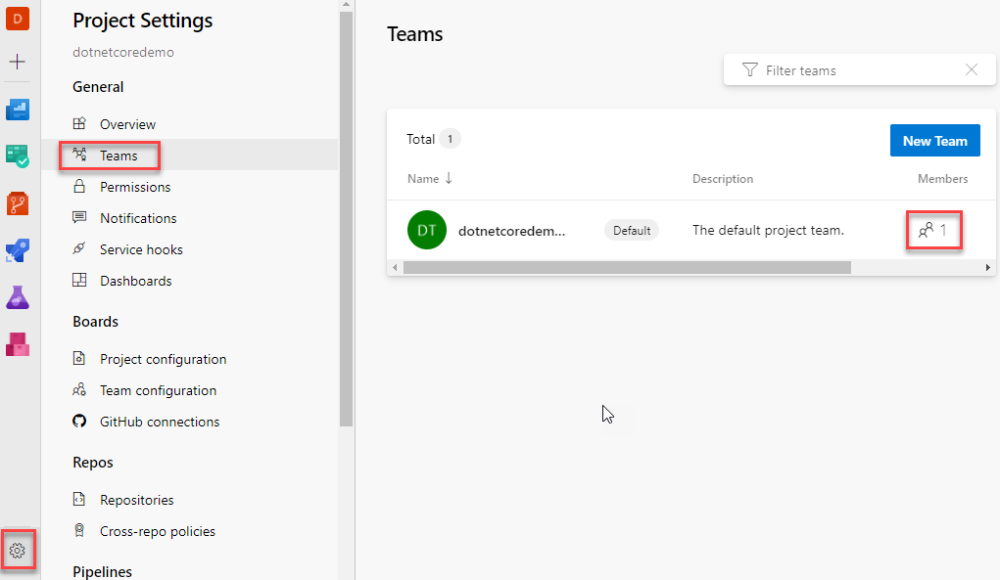
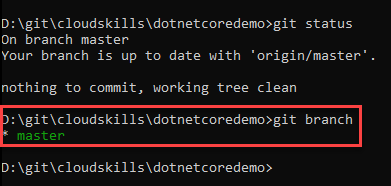
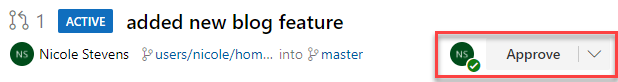
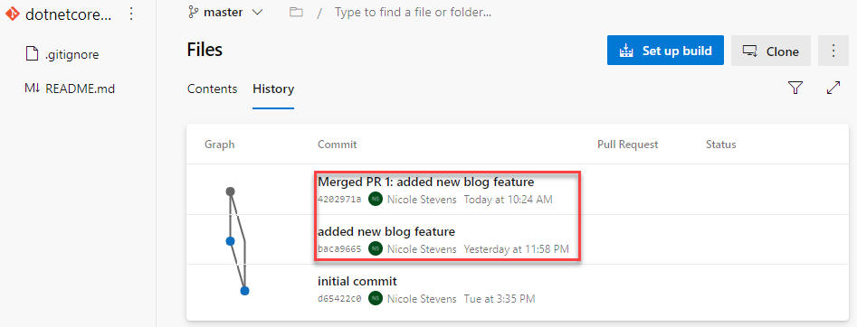

# Working with the Feature Branch Workflow and Pull Requests

Stepping back to [part 1](https://cloudskills.io/blog/git-azure-devops) of this guide you've been a lone developer, cloning your repository, making changes locally and pushing them back up to your remote. What happens when other developers need to make changes, at the same time as you, and in the same repository? How do you ensure the changes follow your coding standards and are of sufficient quality? This is where implementing a git workflow is crucial, to ensure changes are reviewed and merged back into the main code line. A common Git workflow for a team has the following steps:

* Create a *branch* for the changes you are going to make. A branch is an isolated version of the code that you can work on offline without impacting other developers on your team. A branch would typically be for a new feature or a defect fix.

* *Commit* changes to your branch locally. You can keep track of your commit history locally while you work.

* *Push* your changes to the remote repository, in the case of this guide, Azure DevOps.

* Create a *Pull request* so that one or more people on your team can review your changes.

* *Review* the pull request. One or more team members perform a quality check on the code. The criteria for checks of these changes will often be laid out in a code review checklist which are likely to include the coding standards of your team or organisation.

* *Complete* the pull request. The team members who are required to review your changes agree that the criteria for changes have been met. The pull request is completed and the changes are merged into the main code line - the *master* branch.

* *Delete* the branch. Once the code changes and history are merged, it's good housekeeping to delete the branch.

This workflow is often called the [Feature Branch Workflow](https://docs.microsoft.com/en-us/azure/devops/repos/git/git-branching-guidance?view=azure-devops) or [Topic Branch Workflow](https://git-scm.com/book/en/v2/Git-Branching-Branching-Workflows).

The code in your master branch should pass tests, build cleanly, and always be current. Your master branch needs these qualities so that feature branches created by your team start from a known good version of code.  The workflow above enables this.

## Prerequisites

Before working through this guide you will need the following:

* An [Azure Subscription](https://azure.microsoft.com/en-us/), you can create a free account.

* An [Azure DevOps Organisation](http://dev.azure.com/), the basic plan starts with the first five users for free.

* A local installation of [Visual Studio Code (VSCode)](https://code.visualstudio.com/download)

* A local installation of [Git](https://git-scm.com), following the [install guide](https://git-scm.com/book/en/v2/Getting-Started-Installing-Git) for your OS. If you are using Windows, ensure the box is checked to **Enable Git Credential Manager**.

    

    If you installed VSCode before Git, you will also be presented with this option:

    

    This allows you to launch VSCode as the default code editor or difference tool, straight from git on the command line.  Please leave as VSCode for this guide, you can reinstall later to pick a different IDE.

* An [Azure DevOps Project](https://cloudskills.io/blog/git-azure-devops). Check out [part 1](https://cloudskills.io/blog/git-azure-devops) of this blog series, you'll be using the Azure DevOps Project and Repo created in Step 5.

## Step 1 — Configuring branch policies in Azure Repos

You can use branch policies in Azure DevOps to set rules that must be followed when working with branches:

* Require code reviewers

* Limit who can work on branches

* Guarantee changes build before merging to master

These are all examples for branch policies. You are going to explore *Require code reviewers*.

Open [Azure DevOps](https://dev.azure.com) and open the dotnetcoredemo project you created in [Part 1](https://cloudskills.io/blog/git-azure-devops) of this series. Hover over the **Repos** menu item on the left, when the menu pops out click **Branches**.

The default on this screen is to show all of the branches that you have created as the filter "Mine" has been automatically selected at the top. You haven't created a branch yet, so only the master branch will be shown, all users have the master branch under "Mine". Move your mouse to the right of the star (which signifies this is the default branch) and a three dot menu will be displayed:

Click on the **...** context menu and choose **Branch policies** at the bottom of the menu.

This opens up the Branch policies, where you can choose from the following options:

The more commonly used options for branch policies are:

* *Require a minimum number of reviewers* - when a pull request is issued, you can set the number of reviewers that must *approve* the changes before the changes are merged back into the branch.  You can also set the policy such that a reviewer cannot be the person who checked the code in. This will ensure that more than one set of eyes passes over your code, increasing quality and spotting mistakes before the code hits QA.

* *Check for linked work items* - this links a pull request to one or more *work items*. A work item is an Azure Boards unit of work, for example, a bug, feature or task. When this option is turned on, the comments against the commits in the pull request are checked for work item numbers. If none are found, the pull request can either be blocked or a warning message displayed.

* Check for comment resolution - A comment can be placed on a pull request. This will often happen if a reviewer requires clarity on code within the pull request, or if standards are not met. Checking this option requires all comments to be resolved, blocking the pull request completion. This can also be set to optional, displaying a warning if comments are still to be resolved, but the pull request will complete.

For this example, tick **Require a minimum number of reviewers**

Set the reviewers to 2, and tick **Requestors can approve their own changes**. In practice, it's unlikely this box would be ticked, a team would not want the person who wrote the code to review it. You are setting it in this guide to lessen the complexity of the example. Once completed, click **Save changes** at the top.

The master branch now requires two members of the team to approve a pull request before the changes can be merged back to master. However, at the moment you only have one team with one team member in this project. You can check this by hitting the project settings cog on the bottom left, then **Teams** on the Project settings menu:

There is only one team on the list, the default project team. This was created when the project was created. The number under the **Members** column shows how many team members are in this team.

In the next step, you will add another team member by adding users into Azure AD and connecting your Azure AD to your Azure DevOps organisation.

## Step 2 — Integrate Azure DevOps with Azure AD

In this Step you, are going to hook up your Azure DevOps organisation to [Azure Active Directory](https://docs.microsoft.com/en-gb/azure/active-directory/fundamentals/active-directory-whatis) (Azure AD). Azure AD is the identity and access management service for Microsoft cloud services, including Azure and Office 365. Azure AD enables an organisation to grant it's employees access to resources within Azure. If you are familiar with an on-premises Active Directory, Azure AD is an implementation of some of the on-premises Active Directory functionality, including user management.

You will add a new user to Azure AD, then add the same user to Azure DevOps, granting that user the permissions required to approve a pull request.

First, login to the [Azure Portal](https://portal.azure.com/) as the user you setup in the pre-requisites of [Part 1](https://cloudskills.io/blog/git-azure-devops). In the search bar at the top of the Portal, start to type **Azure Active Directory** and click on the resource when the list of matching resources is displayed:

This opens up the default directory for the associated Azure Tenant. The directory houses all of the users for the Tenant. Click **Users** under the **Manage** menu item:

If this Azure account was created specifically for following this guide, there will only be one user present in this directory. This is the user that you logged in as when you created the tenant. Hit **New User** towards the top of the screen:

At the top of the New User page, you'll now have the option to Create a user or Invite a user. Invite gives you the ability to grant access to users who are not housed in your tenant, they do not have to be Azure AD or Microsoft accounts, they just need an email address. For this guide you are going to add a user within your tenant so choose **Create user**

Scroll down to the Identity section, here you will add the User name, also known as the *User Principal Name* and Name for the new user

In Azure AD and on-premises Active Directory, the User Principal Name is the unique identifier for the account. Therefore, the entry for **User name** must be unique for the tenant. If you look to the right of the @ symbol you'll see the default domain name for the tenant, this is setup when you logged in and created this new tenant. Here I have masked the tenant name, if I had logged in as devopsdemo@freemail.com, my default domain name would be devopsdemofreemail.onmicrosoft.com. Therefore, the login when this user is created will be henrykelly@devopsdemofreemail.onmicrosoft.com. You can also view the default domain name on the home page for Azure AD.

The minimum values for creating a user are **User name** and **Name**, fill these in and then tick **Show password**. Take a note of this password, you will need this when you login as the user the first time. Once the minimum values are entered correctly, the **Create** button will activate at the bottom left. You do not need to change anything else on this page, so click **Create**.

Your newly created user is listed in the directory. Note that the **Source** says Azure Active Directory. This means that this user is authenticated to an Azure AD account belonging to this active directory. If you had chosen **Invite a user** a few steps ago this would say External Azure Active Directory.

You now need to check you can login with this user. Open a different browser to ensure you are not using cached credentials. Login to the [Azure Portal](https://portal.azure.com/) with your new user:

You will need to make sure you use your default name and then enter the password noted when you created this user. As this is the first time you have logged in as the new user, you will need to update your password:

Once the password is updated and your new user has logged in without a problem you'll see the welcome screen:

Your user has been added correctly. At the moment the user is only an Azure AD user, the user does not have access to Azure DevOps. Switch back to [Azure DevOps](https://dev.azure.com/) using your original user account which setup Azure DevOps in the pre-requisites. 

To add in users to Azure DevOps you are going to integrate Azure AD. Click on the Azure DevOps icon in the top right, this will take you to the Azure DevOps organisation home page. Click **Organisation settings** at the bottom left.

This will show you the settings that affect the entire DevOps organisation. We want to integrate Azure AD so click **Azure Active Directory** in the menu on the left:

The connect to Azure Ad screen is displayed, click **Connect directory**

On the next screen, you can choose the Azure Active Directory which will connect the Azure DevOps organisation. The user you are signed in as created the organisation and the Azure tenant, so you can choose "Default Directory" in the dropdown to link the two.

You can connect a directory to an Azure DevOps Organisation that was not created by the same user, the user must be a *member* of the Azure AD and an admin or owner of the Azure DevOps Organisation, see this [Microsoft Docs article](https://docs.microsoft.com/en-gb/azure/devops/organizations/accounts/connect-organization-to-azure-ad?view=azure-devops) for more information.

Note the yellow warning box, this will not display when you choose your Azure Active Directory. This is shown as you have invited user(s) to this Organisation that are not in the Default Directory. You can see which users these are by clicking on the **1 out of 2 member(s)** link:

The users listed will be disconnected from the Azure DevOps Organisation, unless they are added as members or guests to the Default Directory chosen for the connection.

Hit **Close** on the Disconnected user pop up and then **Connect** on the Azure Active Directory Connection popup. It takes a few moments to connect the Directory and the Organisation, once this is complete you should see the Connect success popup.

Hit **Sign out** and sign back in again, hit the account you were just signed in as:

Once you've signed back in, the Azure AD Organisation Setting will show the Default Directory as connected:

Now the Azure AD is connected you can assign some access privileges to your users. Staying in the **Organisation Settings** click **Users** in the left hand menu bar:

Azure AD is connected but there is only your user listed. Connecting the directory from Azure AD doesn't give all users in that directory access to the DevOps Organisation, it makes them available to add. Hit **Add users** on the left:

In the **Users** box, start typing the name of the user you added to your directory, once the user comes up in the search click the name to add into the **Users** box. Leave **Access level** as **Basic**, this grants the user access to most features in an organisation. Check out the [about access levels](https://docs.microsoft.com/en-us/azure/devops/organizations/security/access-levels?view=azure-devops) msdoc for more information. Now click the **Add to projects** dropdown and select the dotnetcoredemo project:

Leaving **Send email invites** ticked will send an email to all users selected in Add new users inviting them to the Azure DevOps Organisation.

Now that the project has been chosen to grant access to, the **Azure DevOps Groups** dropdown has been activated and set to **Project Contributors** by default:

The options here are showing the groups for [Default permissions and access](https://docs.microsoft.com/en-us/azure/devops/organizations/security/permissions-access):

* Project Readers - Can view all items but are unable to make changes.
* Project Contributors - Can add, modify and delete items in the project.
* Project Administrators - Mostly the same as contributors but are also able to delete key items such as work items and share objects across a project such as dashboards and queries.

Leave the selection as **Project Contributors**

Don't hit add yet, go back up to the **Users** box and hit the plus sign to add a new user. Type in an email address that is not in the connected Azure AD:

You can still add users outside of the connected Azure AD, but they will need to click the add url in their invite email for access.  Azure DevOps gives a warning of this at the bottom of the Add new users popup:

Remove the non Azure AD user by clicking the cross on the right of the email address. Click **Add** to add your user.

The user is now listed.

You can now go and check the user's access from within the project itself. Click **Azure DevOps** in the top left, then the dotnetcore project pane. Click **Project Settings** at the bottom left to bring the project settings menu up. Now click on **Permissions**:

The permission groups are listed, in the **Members** column for **Contributors** you can see two next to the icon. If you hover over the Members icon for the Contributors group, the avatars for the newly added user and a default permission group are displayed. Click on **Contributors**:

These are the default permissions settings for a contributor. Scroll down to view all of the permissions you can set. Scroll back up and click **Members** at the top of the page:

Here you can verify that the user you added is a contributor to the dotnetcoredemo project.

You can now go back to Branch policies and update the policy on the master branch. Using the project menu on the left hand side, hover over **Repos** and then click **Branches**:

Go back into Branch policies by clicking the hidden menu of three dots **...** at the end of the **master** branch. Then click **Branch policies**:

Scroll down to the bottom of Branch policies and click **Add automatic reviewers**

In the section **Include the following reviewers** add the user you have just given contributor permissions to, along with yourself. Leave **Policy requirement** at **Required**. Note the option **For pull requests affecting these folders**. In this text box you can set a path or paths within the branch that will trigger the automatic inclusion of specific reviewers. This gives you the ability to set senior engineers as automatic reviewers for key areas of your application. For this guide, leave the setting at the default and click **Save**.

Setting the two users as **Required** will mean a pull request cannot be completed on this branch until all of the required reviewers approve the request. The two reviewers are now listed under Add automatic reviewers:

The final part of this Step is to ensure users cannot bypass your newly created policy. On the project menu, click the **Project settings** cog. Now click **Repositories** under **Repos** in the project settings menu. This displays the security settings for the repositories belonging to this project. Click **Contributors** and you will see that the top option **Bypass policies when completing pull requests** is **Not set**.  Using the dropdown you'll want to choose deny, so that your policy must be followed.

The changed automatically saved and a green tick is displayed to the right of the box

You are now ready to move on to the next step and work with feature branches and pull requests.

## Step 3 — Pushing a local feature branch to Azure Repos

Now you have the branch policies setup, you are ready to create a feature branch on your local machine, push it up to Azure Repos and create a pull request. 

Switch back to git and `cd` to the dotnetcore directory you have on your local machine. Run `git status` to check your local repo is up to date. The command `git branch` is used when working with branches. If you run it standalone, git will list all of the branches in your local repo:

You only have one branch currently, that's the master branch as displayed. You can also use `git branch` to add a new branch. To do this re-issue the `git branch` command with the branch name you would like to create tagged to the end of it `git branch users/nicole/home-blog-feature`. Execute `git branch` once more to list the branches in your local repo:

Note that master is green with a star on it's left and your new branch is white. This denotes that you are working on the master branch. Therefore, any changes you make during editing will be against this branch. You need to execute the `git checkout` command to switch to the new branch, so that you can work in isolation on your new feature. To do this run `git checkout users/nicole/home-blog-feature` to switch to your newly created branch. You can then re-issue `git branch` to check you have switched branches:

Your new branch name is green with the star to the left, denoting it is the branch you have checked out.

You may be wondering why the branch name is `users/nicole/name-blog-feature` and not just `name-blog-feature`? This is a common [branch naming convention](https://docs.microsoft.com/en-us/azure/devops/repos/git/git-branching-guidance?view=azure-devops#name-your-feature-branches-by-convention). As you get more familiar with git, you can use conventions such as these to filter a large repo, showing all feature branches or bugfix branches owned by specific users.

Run `code .` to open VS Code and edit the README.md, paste in the markdown block shown below. This is to simulate making code changes in isolation in your application:

Note the bar at the bottom left of VS Code, due to the integration with Git, VS Code displays which branch you are currently working on:

Save the file and switch back to the command line. From within the dotnetcoredemo folder run `git status` to view the file changes. Add the changes with `git add .` and commit with `git commit -m "added new blog feature"`. You are now ready to push the changes to Azure DevOps. To do this you need to tell git to push your new branch to the remote for Azure DevOps, which is origin - `git push origin users/nicole/home-blog-feature`

If you recall from [part 1](https://cloudskills.io/blog/git-azure-devops) of this guide, you can check what you've called your remotes and where they are pointing using `git remote -v`.

Switch back to Azure DevOps and click **Branches** under **Repos** on the project menu. You can now see two branches, the master and your new feature branch. You can see your name under author as you committed the changes and pushed the branch up to the Repo.

Note the folder users/nicole. This shows a small part of the power of a good branch naming convention. Using this convention, you can see all of the branches owned by each of the Repo users by expanding their folder. Hover over the feature branch name, you can now click on the **home-blog-feature branch**:

This takes you directly to the Files section of Azure Repos and into the selected branch to display the files that are part of this branch.

You are happy that your changes meet the feature requirements and now need to merge your changes back into the master branch. To do this you need to create a pull request by clicking on **Create a pull request** on the right hand side.

The top two dropdown boxes of the New Pull Request page show that you are requesting to pull the changes in the users/nicole/home-blog-feature branch into the master branch. Your commit message has been automatically added to the **Title** of the pull request. This is one of the many reasons why you should be thinking about writing good commit messages. 

Moving down to **Reviewers**, here you can add specific members of the dotnetcoredemo project to review your changes. However, you have already setup two users to auto review pull requests to the master branch. So to check this is working leave this blank. **Work Items** can automatically link to items in Azure Boards if the correct item number(s) are in the commit message(s), or you can add them manually here.  If you scroll down below Create, you can see the file changes that are part of this branch. Click **Create**. The Pull request is created and you are switched to the **Pull requests** menu item under **Repos** in the project menu. The pull request you just created is shown:

This is the pull request page, it contains all of the information required to review the pull request. By default, you are taken into the Pull request overview tab. At the top, you can see the pull request has been set to active. Scanning further down below the description, the history of the pull request is displayed. No review of this pull request has started so the history shows that the pull request was created and your new user along with your username were added as required reviewers.

Switching to look at the right hand side, at the top are the **Policies** that have been set on this branch or path(s) within this branch. The red crosses next to each policy show that you have not met the requirements of the policies listed. If Azure Boards work items had been linked to this pull request, these would be listed on the right hand side under **Work Items**. The work items are listed as links to allow swift access to related work items for review. Under **Reviewers** are the required reviewers. If you had selected optional reviewers when the pull request was created, these would also be listed here, grouped under Optional. An email to all reviewers can be sent by clicking envelope icon to the right of **Reviewers**. By default users are not notified that they are required to review a pull request, however, this can be setup in [Notifications for the project](https://docs.microsoft.com/en-us/azure/devops/notifications/manage-team-group-notifications?view=azure-devops).

Hit the **Files** tab at the top:

Here the files that are different between your branch and master are listed.

You are happy that the pull request satisfies the feature requirement and follows coding convention, so click **Approve** near the top right to approve it.

A green tick and your user's avatar is placed next to the Approve button to show you have approved it. Click on the **Overview** to the left of the Files tab:

The overview screen has been updated with the approval. In the left hand column in the history of the pull request, the Approval is shown as the latest item of history. On the right, the **Policies** have been updated to state that one of the two required reviewers have approved this pull request. Looking further down on the right under **Reviewers**, there is a tick next to your user's name, you have reviewed and approved the pull request.

You still cannot complete this pull request. The user you added as part of this guide must review and approve the pull request first. Open another browser and sign into as the new user. Note you'll need to include the Organisation on the URL. In this example, my organisation is `devopsdemo0755`, so my url would be `https://dev.azure.com/devopsdemo0755`.

Enter the dotnetcoredemo project, then navigate to the pull requests list page using **Repos** on the left hand side menu, and then **Pull requests**.

The list displays that there is a required approval assigned to you. Click on the pull request name to enter the pull request overview page. You are going to approve this pull request, but first look at the options a user has after the review. Click on the dropdown arrow to the right of **Approve**

* Approve - agree with the changes as they are.

* Approve with suggestions - approves the pull requests, but opens a text box to leave suggestions for the author to improve the code.

* Wait for author - you can add comments to the overview screen, this option signals that you wish the author to review your comments before continuing.

* Reject - the changes are not acceptable, you must leave a comment to explain why.

Hit **Approve** in the list, the pull request approval screen is updated once more:

On the left hand history trail, the approval by your new user has been added. Moving to the right at the bottom, you have ticks next to both required **Reviewers**. Moving to the top right, you have two ticks next to your **Policies**. Two reviewers have approved and the required reviewers have approved. All of your **Policies** have now been met, and the **Complete** button has become enabled top right. Click the **Complete** button to merge the changes into master:

The Complete pull request popup is displayed. The title of the pull request is brought through to become the complete comment. If there are any associated work items for this pull request, these can be automatically set to completed by ticking **Complete associated work items after merging**. The user you are now logged in as does not have the permissions to delete the feature branch, so this option is greyed out. Click **Complete merge**.

The pull request is marked as complete, with the username that completed it and the complete comment is also displayed.

Go back to the other browser which is logged into Azure DevOps as your original user. Click **Repos** on the project menu, then **Branches** and select the master branch. This opens the files that are on the master branch. You can see that the README.md has the commit against it that came from the feature branch you merged in. Scrolling down you can see the text in the README.md itself, confirming that the merge was successful.

If you now click the **History** tab towards the top of the screen, you can see a detailed view of the commits against the master branch and where pull requests were merged in. This is showing a key part of how Git works on merging. Not only are your code changes brought across, but also the history of your changes.

Note, it is possible to condense the history of a branch when merging, this concept is beyond a beginners guide.

You have confirmed that your code changes and commit history have now been safely merged into the master branch. You can now go ahead and delete the feature branch, the next step will take you through deleting a feature branch.

## Step 4 — Deleting a feature branch

When using Git it's considered good practice to delete your branches once you're finished using them. Apart from being a good housekeeping exercise, this practice means that all of the branches in your repo are current and actively being worked on.

First, make sure you are in the Azure DevOps browser window which is logged in as your original user. If you are logged in as the new user, you will not be able to delete the branch in Azure DevOps as that user does not have permissions to do so. Navigate back to the branches list using **Repos** on the main project menu and then **Branches**. Move your mouse to the right of the branch which has been merged in the previous step. On the hidden menu of **...** choose **Delete branch**

A popup is shown to check you are sure you want to delete the branch. Click **Delete**, your branch is deleted.

If you recall the Complete pull request screen from the previous step, there was the option to **Delete users/nicole/home-blog-feature after merging**.

If the user had the permissions, and the tick box had been checked, the branch would have been automatically deleted after the merge. Therefore cutting out the manual delete that you have just performed.

The branch is now deleted in Azure DevOps, but you still have it on your local repo.  You can see this by switching back to the command line and executing `git branch` having `cd` to your git repo:

The branch users/nicole/home-blog-feature is still present. You need to move off of the branch you want to delete, so switch to master using `git checkout master`. Check you are on the master branch using `git branch`. Now issue the delete branch command, this is performed using a `-d` on `git branch` with the branch name tagged to the end `git branch -d users/nicole/home-blog-feature`:

This hasn't deleted the branch locally, the error message is saying that the changes in users/nicole/home-blog-feature have not been merged into the master branch. This is to stop users from deleting branches that have not been merged. So far the merge has only happened on the remote at Azure DevOps following completion of the pull request. Therefore, you need to pull the merged changes down from the remote to the local master branch with `git pull`:

You have now pulled the changes from the merged to master on the remote on to your local master. Note the section that is `Updating d65422c..4202971`, if you recall the branch history page you looked at in the last step:

The red boxes are circling *commit ids* these are unique identifiers for the commits to a repo. If you look at the first commit id in Azure DevOps and compare to the first one in the command line output, you'll see they are identical. Similarly with the last one in both screenshots. This gives you a small look into what is going on under the hood. If you recall from [part 1]() of this series, a `git pull` performs a `git fetch` and then a `git merge`. In this case `git pull` fetches all the changes from the point where the local repo and remote repo diverged. This is from commit `d65422c`. If there were changes to the master branch locally, `git pull` would try to merge the changes. For this walkthrough there are no changes to merge, so the branch is now at commit `4202971`, identical to that of the remote repo.

If you had decided not to push the branch changes to the remote, you can force the deletion of a branch without a merge using `-D` as described in the command line output.

Try the branch delete command once more `git branch -d users/nicole/home-blog-feature`:

The branch deletes successfully, you can check this by issuing a `git branch` and only the master branch exists locally.

## Conclusion

In this blog post you have explored feature branches and pull requests with Git and Azure DevOps. You created a local feature branch, this branch enabled you to code in isolation to other developers on your project. You committed your changes locally to your new branch, then pushed this branch to your remote. 

Next, you looked at how to integrate Azure AD to Azure DevOps, securing features of Azure DevOps to users in your Azure AD, therefore streamlining user management. You added a new user in Azure AD and assigned this user a Contributor role to your project in Azure DevOps. This enabled you to setup a minimum of two reviewers for a pull request within a branch policy.

You created a pull request, using two required reviewers. You noted how each action in the pull request builds up a history for the pull request that can be viewed. You saw how the branch policies stopped the pull request from being completed until all policy requirements were met. Finally, you deleted you feature branch once your changes and history were safely in the master branch.

This process simulated a small team working on changes and reviewing each others changes ensuring code quality. In the next part of this series you'll work with a sample .Net Core application and push it through a build pipeline.